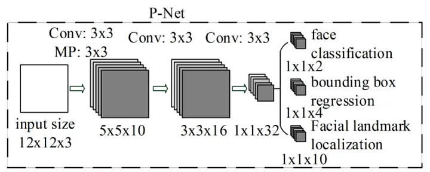
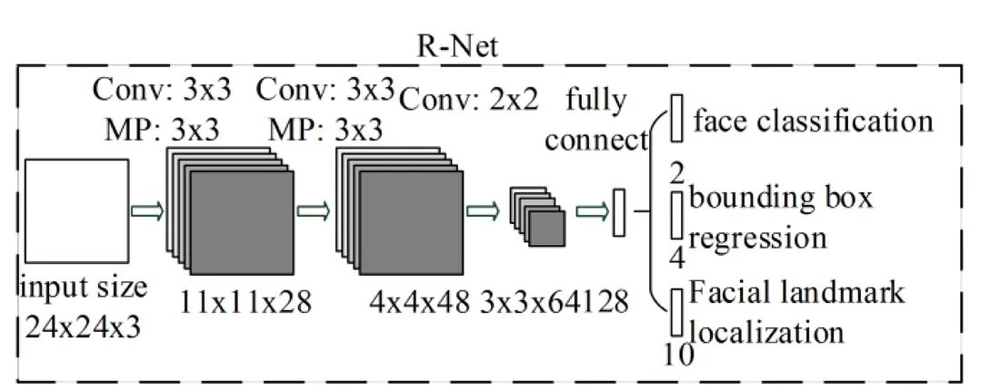
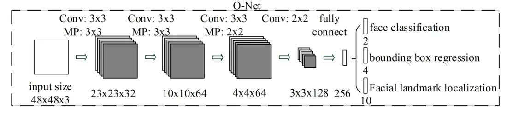
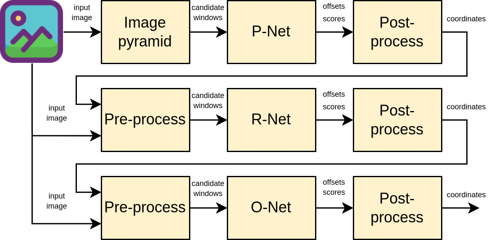
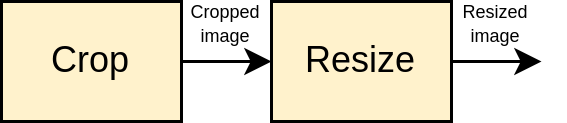
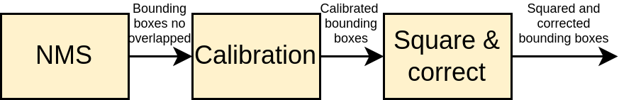

# TensorFlow Lite Micro MTCNN implementation for ESP32-S3
This is an implementation of MTCNN (Multitask Cascading Convolutional Networks) for the ESP32-S3 SoC (System on Chip) using TensorFlow Lite for Microcontrollers. The main goal is to detect faces in low-cost hardware and reduced technical features.

## MTCNN
MTCNN is a framework developed as a solution for both face detection and face alignment. It consist in three stages of convolutional networks that are able to recognize faces and landmark location such as eyes, nose and mouth. 

### P-Net (Proposal Network)
This is a FCN (Fully Convolutional Network) that is used to obtain candidate windows and their bounding box regression vectors. Bounding box regression is a popular technique to predict the localization of boxes when the goal is detecting an object of some pre-defined class. The candidate windows obtained are calibrated with bounding box regression vectors and processed with NMS (Non Max Supression) operator to combine overlapping regions.

<p align="center">
  
</p>

### R-Net (Refine Network)
The R-Net further reduces the number of candidates, performs calibration with bounding box regression and employs NMS to merge overlapping candidates. This network  is a CNN, not a FCN like P-Net sice there is a dense layer at the last stage of its architecture.

<p align="center">
  
</p>

### O-Net (Output Network)
This stage is similar to the R-Net, but this Output Network aims to describe the face in more detail and output the five facial landmarks’ positions for eyes, nose and mouth.

<p align="center">
  
</p>

## TensorFlow implementation
To implement the MTCNN models the tools used were TensorFlow and Google Colab. TensorFlow is an open source library for ML (Machine Learning) developed for Google and it is capable to bulilding and training neural networks to detect patterns and correlations. Google Colab is a product from Google Research and allows write and execute arbitrary python code through the browser, and is specially well suited to ML, data analysis and education.

For a correct implementation of MTCNN, the input and output data of the models must be processed to guarantee the best results. The next diagram shows the diagram block of the pipeline implemented.

<p align="center">
  
</p>

The first step is to perform an image pyramid to create different scales of the input image and detect faces of different sizes. These new scaled images are the inputs to P-Net which generates the offsets and scores for each candidate window. Then these outputs are post-processed to obtain the coordinates where the faces would meet. The R-Net input must be pre-processed with the previous outputs, in this way new candidate windows are obtained. The R-Net outputs are the offsets and scores of the candidate windows that are post-processed to obtain the new coordinates where the faces would meet. Finally, for O-Net, the R-Net process is repeated and the coordinates of the faces in the input image are obtained.

The pre-process consist of two steps, crop the input image according to the bounding boxes coordinates obtained before and resize the cropped images to match the input shape of the model.

<p align="center">
  
</p>

In the other hand, the post-process consist of three steps, apply NMS to combine overlapped regions, calibrate the bounding boxes with the offset obtained before, square and correct the final bounding boxes coordinates.

<p align="center">
  
</p>

All the prrocesses detailed before and the models for TensorFlow, TensorFlow Lite and TensorFlow Lite Micro were developed in the next Google Colab notebook.

[](https://colab.research.google.com/github/mauriciobarroso/mtcnn_esp32s3/blob/main/models_evaluation.ipynb)

## Deploying to ESP32-S3
The last step of model development show the creation of the .c files for all MTCNN models and the .h file for the models settings, which are located in ``main/models/``. The preprocess and postprocess functions that are required for the MTCNN pipeline were implemented in using C/C++ in the files ``utils.cc`` and ``utils.h``, which are located in ``main/``.

The hardware consist in the ESP32-S3-DevKitC-1-N8R8 and a OV2640 camera module. The use of PSRAM is mandatory, instead of ESP32-S3-DevKitC-1-N8R8 another ESP32-S3 with PSRAM can be used.

### 1. Download and install ESP-IDF
This project was developed with ESP-IDF v5.0, so this version or later must be used. The next link contains the necessary instructions to download and install it, do the manual installation.

[Download and install ESP-IDF v5.0](https://docs.espressif.com/projects/esp-idf/en/release-v5.0/esp32s3/get-started/index.html#installation)


### 2. Clone this repository:
```
git clone --recursive https://github.com/mauriciobarroso/mtcnn_esp32s3.git
```

### 3. Configure the project:
Change the values in the ``menuconfig->App Configuration->Camera Configuration`` to configure the camera pins.

```
cd mtcnn_esp32s3/
idf.py set-target esp32s3
idf.py menuconfig
```

### 4. Flash and monitor
This project does not need a screen to display the image and the bounding boxes generated by MTCNN. Instead, it uses the console characters to print the output image and other relevant information. To monitor the console output run:

```
idf.py flash monitor
```

The console should print somethig like this:

```
ESP-ROM:esp32s3-20210327
Build:Mar 27 2021
rst:0x1 (POWERON),boot:0x8 (SPI_FAST_FLASH_BOOT)
SPIWP:0xee
mode:DIO, clock div:1
load:0x3fce3810,len:0x17d8
load:0x403c9700,len:0xe88
load:0x403cc700,len:0x3000
entry 0x403c9930
I (25) boot: ESP-IDF v5.0 2nd stage bootloader
I (25) boot: compile time 14:59:25
I (25) boot: chip revision: v0.1
I (26) boot_comm: chip revision: 1, min. bootloader chip revision: 0
I (33) qio_mode: Enabling default flash chip QIO
I (39) boot.esp32s3: Boot SPI Speed : 80MHz
I (44) boot.esp32s3: SPI Mode       : QIO
I (48) boot.esp32s3: SPI Flash Size : 8MB
I (53) boot: Enabling RNG early entropy source...
I (58) boot: Partition Table:
I (62) boot: ## Label            Usage          Type ST Offset   Length
I (69) boot:  0 nvs              WiFi data        01 02 00009000 00006000
I (77) boot:  1 phy_init         RF data          01 01 0000f000 00001000
I (84) boot:  2 factory          factory app      00 00 00010000 00180000
I (92) boot: End of partition table
I (96) boot_comm: chip revision: 1, min. application chip revision: 0
I (103) esp_image: segment 0: paddr=00010020 vaddr=3c040020 size=98d14h (625940) map
I (206) esp_image: segment 1: paddr=000a8d3c vaddr=3fc93900 size=0437ch ( 17276) load
I (210) esp_image: segment 2: paddr=000ad0c0 vaddr=40374000 size=02f58h ( 12120) load
I (215) esp_image: segment 3: paddr=000b0020 vaddr=42000020 size=3a4d8h (238808) map
I (257) esp_image: segment 4: paddr=000ea500 vaddr=40376f58 size=0c8f0h ( 51440) load
I (267) esp_image: segment 5: paddr=000f6df8 vaddr=50000000 size=00010h (    16) load
I (274) boot: Loaded app from partition at offset 0x10000
I (274) boot: Disabling RNG early entropy source...
I (287) octal_psram: vendor id    : 0x0d (AP)
I (287) octal_psram: dev id       : 0x02 (generation 3)
I (288) octal_psram: density      : 0x03 (64 Mbit)
I (292) octal_psram: good-die     : 0x01 (Pass)
I (298) octal_psram: Latency      : 0x01 (Fixed)
I (303) octal_psram: VCC          : 0x01 (3V)
I (308) octal_psram: SRF          : 0x01 (Fast Refresh)
I (314) octal_psram: BurstType    : 0x01 (Hybrid Wrap)
I (320) octal_psram: BurstLen     : 0x01 (32 Byte)
I (325) octal_psram: Readlatency  : 0x02 (10 cycles@Fixed)
I (331) octal_psram: DriveStrength: 0x00 (1/1)
W (336) PSRAM: DO NOT USE FOR MASS PRODUCTION! Timing parameters will be updated in future IDF version.
I (347) esp_psram: Found 8MB PSRAM device
I (351) esp_psram: Speed: 80MHz
I (355) cpu_start: Pro cpu up.
I (359) cpu_start: Starting app cpu, entry point is 0x40375528
0x40375528: call_start_cpu1 at /home/mauricio/esp/esp-idf-v5.0/components/esp_system/port/cpu_start.c:142

I (0) cpu_start: App cpu up.
I (650) esp_psram: SPI SRAM memory test OK
I (659) cpu_start: Pro cpu start user code
I (659) cpu_start: cpu freq: 240000000 Hz
I (659) cpu_start: Application information:
I (662) cpu_start: Project name:     mtcnn_esp32s3
I (668) cpu_start: App version:      c23ca34-dirty
I (673) cpu_start: Compile time:     Mar 30 2023 15:01:53
I (679) cpu_start: ELF file SHA256:  2661372e3fc5a36b...
I (685) cpu_start: ESP-IDF:          v5.0
I (690) heap_init: Initializing. RAM available for dynamic allocation:
I (697) heap_init: At 3FC99960 len 0004FDB0 (319 KiB): D/IRAM
I (704) heap_init: At 3FCE9710 len 00005724 (21 KiB): STACK/DRAM
I (710) heap_init: At 600FE010 len 00001FF0 (7 KiB): RTCRAM
I (717) esp_psram: Adding pool of 8192K of PSRAM memory to heap allocator
I (725) spi_flash: detected chip: generic
I (729) spi_flash: flash io: qio
I (733) cpu_start: Starting scheduler on PRO CPU.
I (0) cpu_start: Starting scheduler on APP CPU.
I (763) s3 ll_cam: DMA Channel=4
I (763) cam_hal: cam init ok
I (763) sccb: pin_sda 4 pin_scl 5
I (773) sccb: sccb_i2c_port=1

I (783) camera: Detected camera at address=0x30
I (783) camera: Detected OV2640 camera
I (783) camera: Camera PID=0x26 VER=0x42 MIDL=0x7f MIDH=0xa2
I (863) s3 ll_cam: node_size: 3072, nodes_per_line: 1, lines_per_node: 16
I (863) s3 ll_cam: dma_half_buffer_min:  3072, dma_half_buffer:  9216, lines_per_half_buffer: 48, dma_buffer_size: 27648
I (873) cam_hal: buffer_size: 27648, half_buffer_size: 9216, node_buffer_size: 3072, node_cnt: 9, total_cnt: 2
I (883) cam_hal: Allocating 18432 Byte frame buffer in PSRAM
I (893) cam_hal: Allocating 18432 Byte frame buffer in PSRAM
I (893) cam_hal: cam config ok
I (903) ov2640: Set PLL: clk_2x: 1, clk_div: 3, pclk_auto: 1, pclk_div: 8

Time for P-Net = 65
Ouput bboxes:1
Time for R-Net = 77
Ouput bboxes:1
Time for O-Net = 264
Ouput bboxes:1
^^77^7^^7777777x77777777777777777^x777777777777777^777^777^7^^^^^^^^^^^^^^^^^^^^ii^^^iiiiiiiiiii
77777^777777777x7777x7xxx7xxxxx*xxxJ**x77xJJ777^^77^;;;;;;.i;^^7^xx********J*JU**Jx***J*xx7xx777
7777777777777x7^7^^^^^ii^^xxJUJJ&**77x7xxxUQQHHNNNU&#Q&&&###########UUUUUUUJJJJJJ*****xxxxxx7777
*JJU##&&&QHHHQQQQ&&&&&&&&&&&####7xi7^77xxx7i7i*J#J##&&&&&&&&#########UUUUUUUJJJJ*******xxxxx77^7
#########&&&&&&&&&&&&QQQ&&&&#&7^777x*x7*x^^^77777i*U#&&&&&&&&&########UUUUUUUJJJJJ*****xxxx7x777
########&&&&&&&&&&&QQQQQ&#&QU^77^^7x^^^7^^^7777x7xJ^7&&&&&&&&&&######UUUUUUUUUJJJJJJ*****xxxx777
######&&&&&&&&&&&&QQQQQQ&#x77^7^7777^^^^^^^^7^^^777#7&&&&&&&&&&########UUUUUUUJJJJJJ******xxxx77
#&#&#&&&&&&&&&&&QQQQQQQQQJ^7^^^77777^^^^^^^^7^xi^7^^7xQQQQ&&&&&&&#######UUUUUUUJJJJ******xxxxx77
#&&&&&&&&&&&&&&QQQQQQQQJ7x7^^^^^^7^^^^^^^^^^^^*7^7^^^xQQQQQQ&&&&########UUUUUUUUJJJJJ*****xxxxx7
##&&&&&&&&&&QQ&QQQQQQHUx777^^7^^^^^^^^^^^^^^^^^7Ux7^7^&&QQQQQ&&&&&&######UUUUUUUJJJJJ****xxxxxx7
&&&&&&&&&&&&QQQQQQQQQ^7^x^^^7^^^^^^^^^^^i^^^^ii^77^7^7^UHQHQQQ&&&&&######UUUUUUUUJJJJJ****xxxx77
&&&&&&&&&&&QQQQQQQQH7^^^^^^^^^^^^i^^^^^i^^^^^^ii^^^^^^^iNHHHQQQ&&&&#####UUUUUUUUJJJJJJ*****xxx77
&&&&&&&&&&&&QQQQQQQ#^7^^^^^^^^^^^^^^^^^^^^^iiiii^^^^^7^i.NHHQQQQQ&&&######UUUUUUJJJJJJ*****xxxx7
&&&&&&&&&QQQQQQQQMx^77^^^^^^^^^^^^^^^^^^^^^^^ii^^i^^^^^x*i@HHQQQQ&&&&#####UUUUUUUJJJJJ******xxxx
&&&&&&&&&QQQQQQQNi7^^^7^^^^^^7^^^^^^^^^^^^^^^^^i^^^^^^^x7i&HHHQQQ&&&&######UUUUUUJJJJJ*****xxxxx
&&&&&&&&QQQQQQQQUi^^^^^^^^^^^^^^^^^^^^^77^7777777^^^^^i^^7iNHQQQQ&&&&######UUUUUUUJJJJJ*x***xxxx
&&&&&&&QQQQQQQQQ77^^xxxxxxxxxxxxxxxxxxxxxxxxxxxxxxxxxxxxxxxxxxxxQ&&&&######UUUUUUUJJJJJ*****xxxx
&&&&&&&&QQQQQQQH*77^x^^i^^^^^^^^x**JJJJJJJJJJJ***x77^^ii^^^QHHQxQ&&&&######UUUUUUUUJJJJ*****xxx7
&&&&&&&&QQQQQQQQQ^^^x^^^^^^^^77xJJJJJJJUUUUUUUJJJJ77^^^ii^^QHHQxQ&&&&#######UUUUUJJJJJJJ****xxx7
&&&&&&&&QQQQQQQQHi7^x^^^^^^^^7*JJJUUUUUUUUUUUUUUJ*x77^^^^^i&QQQx&&&&########UUUUJJJJJJJ****xxxxx
&&&&&&&&&QQQQQQQH;^^x^^^^^^^7*JUU###UUUU#UUUUUUUUJJJx7^^^^^JQQQx&&&&&######UUUUUUUJJJJ******xxxx
&&&&&&&&QQQQQQQQQ^^^x^^^^^^7*JJUU####UUU#####UUUUJJJ*x^^^^^;HQQx&&&&&######UUUUUUUJJJJ*****xxxxx
&&&&&&&&&&&QQQQQ&x^^x^^^^^^7JUUUU###UUU#######UUUJJJ**7^^^^;HQQx&&&&######UUUUUUUJJJJJ*J***xx7xx
&&&&&&&&&&QQQQQQQJ^7x^^^^^77JUUU##U##########U#UUUJJJJx7^^^;H&&x&&&&######UUUUUUUUJJJJ*****xxxx7
&&&&&&&&&&QQQQQQQ&i^x^^^^^^xJUUU#UUU###U########UUJJJJ*^^i^;H&&x&&&#####UUUUUUUUJJJJJJ****xxxx7x
&&&&&&&&&&QQQQQQQ&*7x^^^^^7xJUUUUU##############UUJJ***7^^^;Q&&x&&&#####UUUUUUUUJJJJJ****xxxx77x
&&#&&&&&&&&&&&&QQ&&*x7^^^7^7JUJUU#############U&UUU777*x^^^iQ&&x&#######UUUUUUUUJJJJ******xx77xJ
##&&&&&&&&&&&&&&QQ&#x^7^^^7*UJ*JJUUU&&######&Uxii^77^^^77^^iJ&&x&#######UUUUUUUJJJJJ****xxxxxx*J
####&&&&&&&&&&&&&&&&x*7^^^7J*xxx77^^^7J#####J7^^7i^^x7777i^iJ#&x#######UUUUUUUJJJJJ****xxxxx7JJU
########&&&&&&&&&&&&xU^^^^*J777^^i^^^7JU###UJJJJU##UJJx7x^^iU#&x#######UUUUUUJJJJJJ**xxxxxxx*JUU
########&&&&&&&&&&&&xQi^^7J77xxJUUJUUJJU###UJUUJxx^^7JJxxx^i&#&x######UUUUUUUUUJJJJ***xxxx*JUUU^
#########&&&&&&&&&&&xQi7^*J7*J#U7^^^UJJJ###UJUJ7U#^^77J**xi;Q&&x&############UUUUUUUJUJJJJJUUU7i
#########&&&&&&&&&&&xQi^iUJJJJ^^&Ui^^7JJU#UJJJ*#&Hx;7^J*J*iiNHQxQQQQQ&&&&&########UUUUJUUU###7i^
########&&&&&&&&&QQQxQi^iUUUU*7U#H;#7xJUU#UUJJJ*J#*777*JJ*^^NHHxHQQQQQ&&&&QQQQ&&&UUJ7i;;;;;;i^^^
#&&&&QQQQQQQHHHHHHNNxN^7iUUUJxx*&Q*x^*JUU##UUJJJJJUJJ**JJ*^7@MNxHQQ&#U**x7^^^^^^i^^^^^iiiiiiiiii
&&QQQQQQHHHHHHHNNNNNxNx7;JUUUJJUUJJx7JUUU##UUUJJUUUUJJJJJJ*^*UJxJJJJJ***xx777^^^^^^iiiiiiiiiiiii
&&QQHHNMMMMMMMNNMMNHxH^^;JUUUUUUUUUJUUUUU##UUUUUUUUUUUUJJJ*iJ*UxU**7x77iii^^i^^^iiiiiiiiiiii^^i^
i;^^^7x***JJJUUUUUUUx#^7.JUUUU####UUUUUU###UUUUUU####UUUJJU^*J*x^^7x77xxx777^^^^^^^^^iiiiiiiiii^
x7xxx*****JJJJJUJJUJxU7i;JUUU##&#UU##UUU###UUUUUUU###UUUUJJ7*JxxJ******xx7x77^^^^^^i^iiiiiiii^ii
^77^7777^7777x*JJUU#x*J7iUUU###&##UUUUUU#&#UUUUUUUUU###UJJUJJJ*xJJJJ*J**xx77777^^^^^^^iii^iiiiii
777xxxxx**JJJJJJUUUUx*J*;UUU######U#UUUU##U#UUUJUUUU##UUJJJJJ**xJJJJJ****xx777^^^^^^^^iiiiiiiiii
7xx7xx*x*JJJJJJJUUUUxJJ#.UUU#####UU#UU#UUUUUUxUJUUUU##UUJJJ*JxUxUJJJJ*J***xxx77^^^^^^^^iiiiiiiii
x77xxx**JJJJJJJJUUU#xUJU;UUUU###UUUUU#^i7JJ*^iJJUUUUUUUUJJ****UxJJJJJJJ****xxx777^^^i^i^iiiiiii^
xxxxx***JJUUUUUUUUU#xUUJ^UUUU#####UUUUJ*UJJU#UJJUUUUU#UJJJ*7**UxUUUUJJJ****xxx77^^^^^^^^i^iiii^i
xxxx****JJJJUUUUUU##x#U*7UUJUU##U##UUJJU#UUUUJJJUUUUUUJJJJ*x*JUxUUUJJJJJ****xx777^^^^^^^^^iiiiii
xx*****JJJJJUUUU##U#x##*xJUJUUUUUU##UUUUU#UUUJJJUUUUUUJJJ****UUxUUUUUJJJ*****xx777^^^^^^iiiiiii^
xxxx**JJJJUUUUUUU###x##J*UUUUUUUUU#UUJUUU#UUUJJJJUUUUUUJJJ***U#xUUUUUUJJJ****xx777^^^^^^iiiiii^^
xxx***JJJJUUUUUUU###x##JJJUUUUUUUUUUJJUUUUUUUUUUJJUUUUJJJJ*JJ#UxUUUUJJJJJ****xxx77^^^^^^^iiiiii^
xx**JJJJJUUUUUU#####x###JJUUUUUUUUUJJUUJJJJJJJJUUJJUUUJJJJ**U##x#UUUJJJJJ******x777^^^^iiiiiiii;
x***JJJJUUUUUUUU####x&&&JJUUUUUUUJ*JUUJJJ*J***JUUJUUUJJJJJ*&###xUUUUUUUJJJ****xx777^^^^^iiiiiii^
xx**JJJJUUUUU#U#####x#&&*U#UUUUUUJJJJJ***J*x**x*JUUUUJJJJ*U####xUUUUUUJJJ******xx777^^^^^iiiiii#
xx***JJ**UJJJx7xx7^^x^&&&Q#UUUUUUJJJxxUUUUUUJJJ*xUUUUJJJJJQQ&Q#xUUUUUUUJJJJ***xxx777^^^i^^iiii;U
***^^7^^^^7i^77^7^7xxH&&&&&U#UUUJUJ***JJUUUUJJJJJJJUUJJJ*x7;;.^x&#UUUU#UJJJ****xx777^^^^^^iiiiiU
xx**^777777xxx*xxxx*x&&&Q&&UUUUUUUJJJJJJUUJUJJUUUJJUUJJJ*.iiiiix.UHHH&&UJJJ****xxx77^^^^^^iiiixU
****7777xxxx***JJUJJx&QHHHH&UJJUUUUUUUUJ***JUUUUUJJJJJJJUiiiiiixi;@MN&Q#JJ******xx77^^^^^^^iixUU
*x*J777x*J*x^^i^i;i*x&7^iii^JUUUJUUUUUUJ***JJUUUJJJJJJJJU^iiiiixi^i@MHHJJJJ*****xx77^^^^^^iii&J#
xx*x777xxii^^^^7^^^#x^ii^^^i^JUJJUJJUUUUJ*JJUUUUJJJJJJJ*J^iiiiixii;MMHQxJJJ****xxx77^^^^^iiiiHx.
***x777^^^^^^^^*^iJixi^^iii^^JJJJJJJUUUUJUUUUUUUUJJJJJ**Ji.;;iixiii*MN&7JJJJ****xx77^^^^^iiiiii;
****777^7^^^^^^J^Ui^x^^^ii^ii7JJJJJJJUUUUUJUUUUUJJJJJ****M&#NU;xiii;MN#^JJJJ***xxx77^^^^^^i^i;;;
**J^^7^^^^^^^^^x77^^xxxxxxxxxxxxxxxxxxxxxxxxxxxxxxxxxxxxxxxxxxxxx.^;@NU^JJJ****xxx77^^^^ii;;;i;;
**J^^7^^^^^^JJJxJi^iiiiiiiii^iJ******JJJJJJJJJUJJJ****J*J^7^J#*&&H7.MMU^JJJ*****xx777^^i;;;;iiii
****^77^^^^77^^^^^^^iiiiiiiiiQ****xxxxx7xxJ**JJ*****JJJJxi7xx^ixJU#NNNU^JJJ*****xx7^^^^^;;;;iii.
**J7^7^^^^^^7^77^ii^^iiii^;U&^*****x77^77^^^777x***JJJJ**^^7^JxJ7*UJ&#&&*JJ*****xx77^^^^i;;;;;;.
**Jx7x^^^^7^7^^^^i^^^^ii;;QU*^J******7^^^^7^7*JJ*JJJJJJ*xi^7^x*x^#UU#&###HH#****xx77^^^^i;;;;ii;
**J*xx^^^^^7x^^^^^i^^i.UMQ#*^7J********JJJ**JJJJJJJJJJJ**^^^^xxJiUUU*J*UQ#Q&&QQx7x77^^^ii;;;;x^.
**J*77^^^^^^7^77^^i^;NH&N*J7^x***********JJJJJJJJJJUUJJJ*x^^^7x*^UUJ*xJU#UUJ**J#QHUii^^^i;i;;i;.
***x777^7^i77777^i*UQ#&#7#x^xx*******x**JJJJJJJJ*JUJUJJJ*7^7^7x7^JJJU####U###U###UJUUi^ii;;;;;i;
**Jx77^7^ii^7^7^JH&##&U*&*7xxxxx*JJ*x***JJJJJJJJJUUUUJJ*xi^7^7x7^J**UUU####U##U#UUUUUUii^;;;;;^;
x*J777^^^^^^7^xQ&&&&QJU#U*7J**xx**JJ*xxJ*JJJJJJJUUUUJJJJx^^^^^x7^*x*JUUU###UU##UUUUUUUJ&;;;;;;;;
x*J777^^^^ixHH&&&J###*^UJ*7J**xx*****Jx*x****JUJUUUUJJJ**i^^^777ixx*JUUUUUUUUUUUUUUUUJJ*JJ;;;;;;
xxJ^77^^i#MQ&&UJ#**Q&&*Ux*7J**xx*********JJJJJJUUUUUJJJJJ^7^^77^i77xJUUUUJJJJUJJJJJJUJ*J**#i.;;;
xxJ^7x;xN#J#&Q&Q#QJ7*JU*xxxJ***xx**JJ**JJJJUJJJJJJUUJJJ*U777^^^i^777*UUU*JJJJJJJJJ*JJJ^*x***Uii.
xxJ7iUHJ#&#&#&&&U&&*x*UJ*xxJJ*xxx****J***JJJJJJJJUJJJJJJ*7^^^^7i^^77*JJJx**JJJJ*******^*7xx*x*x^
xxJ^&########&#&&#&&J*JJ*x7JJ*xxxxx******JJ*JJJJJUJJJJJJi7^^^^^^^^77*J*xx****x*xxxxx*x^x7x77x7xx
x7&J&&##########&####UxUU77*JJx77xxx******JJJJJJJJJJJJJJ^7^^^^^^^^77xx777***7x77777xxx^x77777777
xUJU###U####U#UUU#&&#U^JU777JJ**x77xxx*****JJJJJJJJJJJJ7^^^^^^^^i^77777^xxx77777^^^7x7^7777^^7^7
U#UU#UUUUUUUUUJJJU###U7**77^JJJ*xx7xxx*******JJJJJJJJJU^^^^^^^^^i^^7^^^^7x7777^^^^^^7^i^^^^^^^i^
##UUUUUUJUJJJUJ**JU##UJxx77^**JJ**x7xx**x*******JJJJJJx7^^^^^^^^i^^^^^^^7x7777^^i^^^7^i^^^^^^iii
UUUUJJJJJJ*J*J**xxJU#UUx**777JJJJ*x77xx*********JJJJJJi^^^7^^^^^i^^^^^^^^^^^^^^^i^ii^^iii^^^^iii
UUUU**Jx******J*xx*UUUUxxx7^7JJJJJ*xxx******J***JJJJJx^^^^^^7^^^^i^^^^^^^^^^^^^iiiii7^iiii^^iiii
UUU******J*xx*J*xxxJUUJxxx7^77JJJJJ*xx***J*****JJJJJU7^^^^^^^^^^^i^^^^^^^^^^^^^^iiii^iiiiiiiiiii
#JJx*x**x*xx7x**xxx*JUJ77^^^^^JJJJJ*******JJJJJJJJJJ*77^^^^^^^^^^i^^^^^^ii^i^^^iiiii^^iiiiiiiiii
*JJxxxxxx7x77x***77*JJ*77^7^77*JJJJJ***J**JJ*JJJJUJJ^^^^^^^^^^i^^i^^^^ii^ii^i^^iiiii^iiiiiiiiiii
*Jxxx7xxxxxx77xx77^7***x7^^^^^7JJJJJJJ****JJJJJJJUUJ^^^^i^^^^^^^^ii^^^iiii^iiiiiiiiiii;iiiiiiiii
JJx77777x77777xxxx^7xxx777^^^^^xJJJJJJJ*JJJ*JJJJJJJx^^^^^^^^^^^^^iii^^^ii^iiiiiiiiiiiiiiii;iiiii
**777777777777xx7x^77x*7^77^^^^iJJJJJJJJJJJJJJJJJJU7^^^^^^^^^^i^^ii^i^^^iiii^^iiiiiiii;ii;;;;iii
xx777^777777777xx7^^^7x7^^^^^^^^xJJJJJJJJJJJJJJJJJ*7^^^^^^^i^^^^^^iiii^iiiiiiiiiiiiiiii;iii;iiii
777^^^^777^77^x7x7^^^777^^^^7^^^^JJJJJJJJJJJJJJJJJ7^^^^^^^^i^^iiiii^i^^^^iiiiiiiiiiiiiii;;;;;;ii
^77^^^^^777x777777^^^^^^i^^^^^^^^7JJJJJJJJJ*JJJJJx7^^^^^^^ii^^ii^iiiii^^^iiiiiiiiiiiiiii;;;;;i;i
^^^^^^7^777777777x7^^^^7^^7^^^^^^^xJJJJJJJJJJ*JJ*7^^^i^^^^^^^iiiiiiiiiiiiiiiiiiiiiiiiii;;;;;;;;;
i^7^^^^7^7777^77777^^^^x^^^^^^^^^^^xJJJJJJJJ*JJJ7^^iii^^ii^^^^iiiiiiiiiiiiiiiiiii;iiiii;;;;;ii;;
i^^^^^^^^^^77^7^^77^^^i^^^^^^^^^^^^7***JJJJJJJ**7i^^^^iiiiiiiiiiiiiiiiiiiiiiiiiiiiii;;i;;;;;;;;;
i^^^i^^^^^7^^^77x77^^^^^^^^^^^^^^^^^^J******JJ*xi^^^^^^;i^i^^iiiiiiiiiiiiiiiiiiiiiiiiii;;;;;;;;;
i^7^i^^^^^7^7^^777^^^^^i^^^^ii^^^^^^^7****J***x^^^ii^^ii^^iiiiiiii^iiiiiiiiiiiiiiii;;ii;;;;;;;;;
i^^^ii^^^^^^^^^77^^^^^ii^^^^^i^^^^i^^^^******7^^iii^i^i^iiiiiiiiiiiiiiiiiiiiiiiiiiiii;ii;;;;;;;;
i^^^^^^iii^^^^^^^^^^^^^^^^^^^i^^i^^^^^^i****x^^i^iiiiiiiiiiiiiiiiiiiiiiiiiiiiiiiiiiiiiii;;;;;;;;
MTCNN time = 408

```

The output image is printed with ASCII characters and to recognize the face and its bounding box the text size must be reduced.

## Credits

## License

MIT License

Copyright (c) 2023 Mauricio Barroso Benavides

Permission is hereby granted, free of charge, to any person obtaining a copy of this software and associated documentation files (the "Software"), to deal in the Software without restriction, including without limitation the rights to use, copy, modify, merge, publish, distribute, sublicense, and/or sell copies of the Software, and to permit persons to whom the Software is furnished to do so, subject to the following conditions:

The above copyright notice and this permission notice shall be included in all copies or substantial portions of the Software.

THE SOFTWARE IS PROVIDED "AS IS", WITHOUT WARRANTY OF ANY KIND, EXPRESS OR IMPLIED, INCLUDING BUT NOT LIMITED TO THE WARRANTIES OF MERCHANTABILITY, FITNESS FOR A PARTICULAR PURPOSE AND NONINFRINGEMENT. IN NO EVENT SHALL THE AUTHORS OR COPYRIGHT HOLDERS BE LIABLE FOR ANY CLAIM, DAMAGES OR OTHER LIABILITY, WHETHER IN AN ACTION OF CONTRACT, TORT OR OTHERWISE, ARISING FROM, OUT OF OR IN CONNECTION WITH THE SOFTWARE OR THE USE OR OTHER DEALINGS IN THE SOFTWARE.